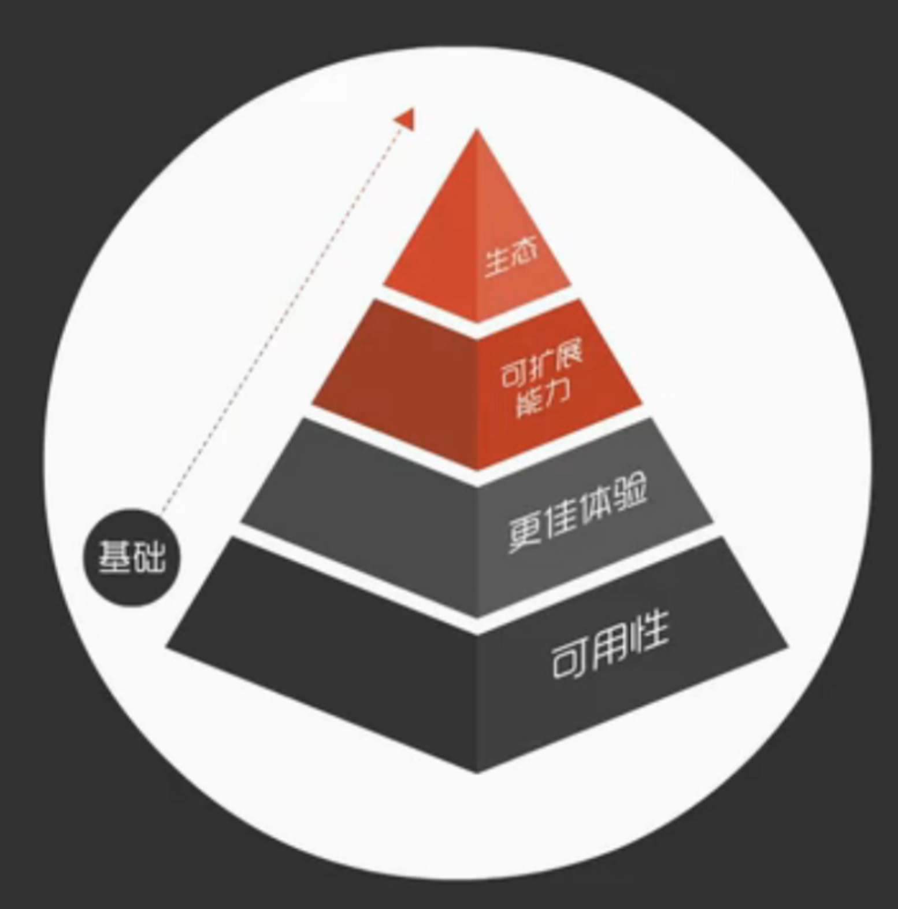

# 需求分析指南

## 一、目的

1、围绕用户需求做方案；

2、使他人了解做这个需求的目的；

3、让自己想清楚，锻炼产品基本功。

## 二、怎么做

### 1、首先需要把需求思考得全面：5W2H

| 做什么   | 怎么做                                                   | 说明                |
| -------- | -------------------------------------------------------- | ------------------- |
| who      | 1、用户是什么角色、有哪些角色 2、这是一个通用需求吗 |                     |
| where    | 使用场景是什么                                           |                     |
| what     | 用户需要的是什么                                         |                     |
| why      | 1、为什么用户会需要 2、想要解决什么问题             | 反思 "what"是否合理 |
| when     | 时机合适吗                                               |                     |
| how      | 怎么满足用户需求                                         |                     |
| how much | 1、要做到什么程度 2、边界是什么                     |                     |

分析后输出**用户故事、需求列表**

### 2、其次要对需求优先级进行排序

产品需求从基础到高级，列序如下：

拿某教学软件举例：

| 需求层次 | 归类       | 功能举例                                                                                              |
| -------- | ---------- | ----------------------------------------------------------------------------------------------------- |
| 高级     | 生态       | 联动教学空间、联动备授课、导入第三方资源                                                              |
| ↑        | 可扩展能力 | 分组互动、纸笔课堂、支持多种平板型号、支持移动授课...                                                 |
| ↑        | 最佳体验   | 答题支持截屏、屏幕推送支持回传、拍照上传支持书写、支持四分屏、课件推送答案回传...                     |
| 基础     | 可用性     | 登录、师生连接、网络稳定性、打开速度、锁屏、答题基础功能、互动基础功能、课程推送与回收、资源覆盖面... |

**原则：**

越基础的功能，越是我们早期应该关注的点，只有在满足了基础需求的情况下，才能向上去逐步满足高级需求。

**思考：**

a. 基础需求是否都已满足了，做得好吗？

b. 你要新加的功能属于哪个层次，如果是高级功能，会对基础功能造成影响吗？

### 3、最后要思考能实现的方案有哪些，哪种方案更优

**思路来源：**

竞品、现有规范、脑暴...

**可选的输出工具：**

流程图、思维导图、原型图... or 任何能讲清楚你思路的工具

**分析方案优劣：**

SWOT
