# 九宫格配色法

## 介绍

九宫格配色法其方法是：将画面分成九个格子进行综合性配色练习。

我们尝试用一种新思路，来重新定义颜色的使用方法，这种思路和传统的配色方法不同，不需要懂得理论，不需要懂得互补色，主要是利用色板进行模块化的区分，让每个颜色的色块形成一个单独的区域，减少颜色过多产生的配色障碍。

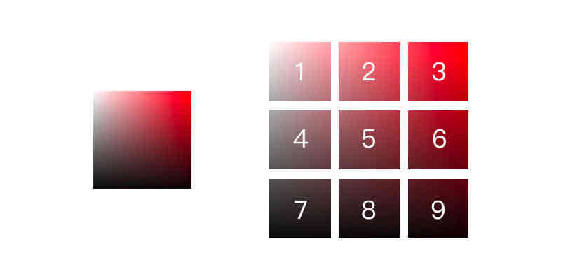

选择三组常见的设计类型（运动/文字/UI），同时保证每组图片风格不同，通过PS的吸管工具，分别吸取图中的主色和辅助色。

## 运动类

吸取的时候，注意每个色值在色板上的位置，这很重要。

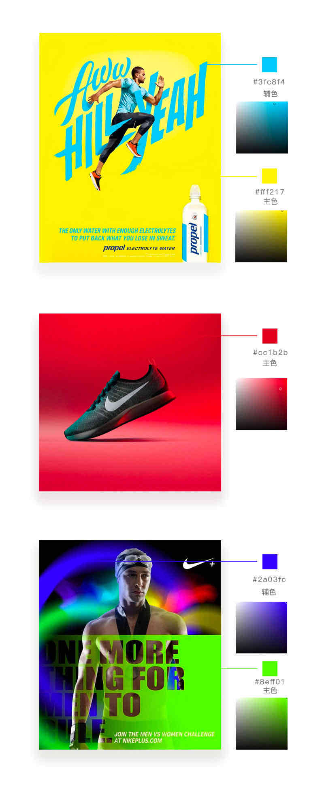

通过吸取颜色，得到了颜色的位置图，发现都偏向一个位置，为了更好的对应我们的九宫格，我们在叠加一次，来确定颜色的具体位置。

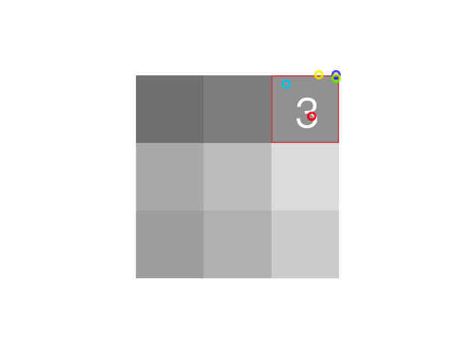

海报的主色调，都存在于九宫格的3好区域内，为什么都存在于这个方位呢？因为这个方位的颜色饱和度是最高的，而饱和度的高低，代表情绪上的不同状态。

来看看为什么会有这样的影响：

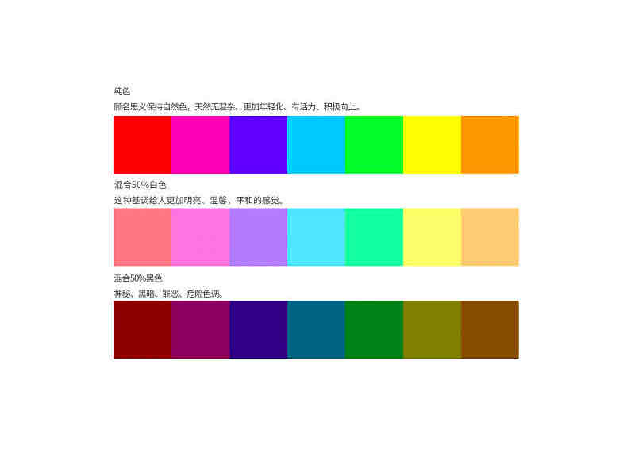

如上图，很多运动类产品设计都会采用高饱和度的颜色，来衬托年轻的氛围，因为这种颜色，更能体现年轻现代化，有活力，积极向上，更符合这个年龄层的心理颜色。

可能这3个案例不能很好的解释颜色变化产生的影响，那么，尝试降低饱和度，我们继续观察：

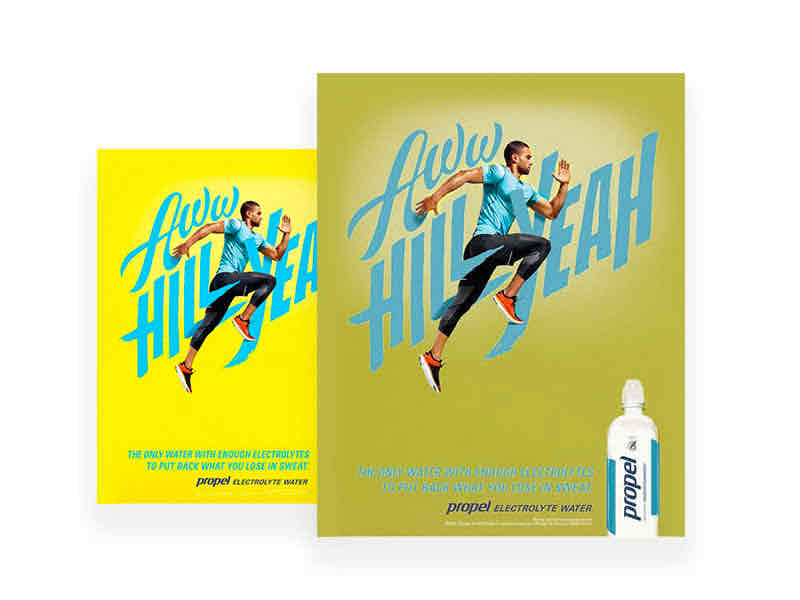

饱和度降低后，整体的色调偏暗，看起来没有活力，而且有枯萎的效果，如果是运动饮料，无疑是错误的颜色。

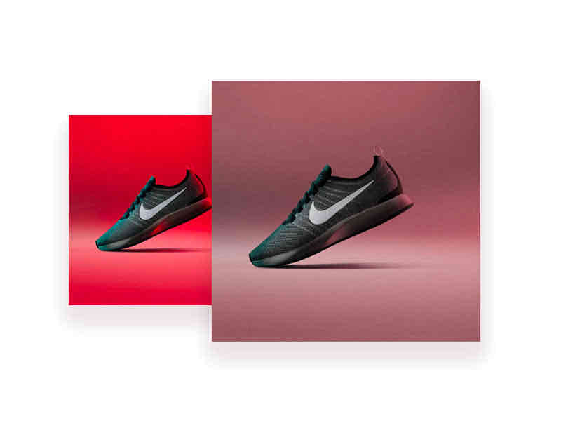

鞋子的背景颜色降低后，没有视觉冲击力，也变成了很普通跑鞋。

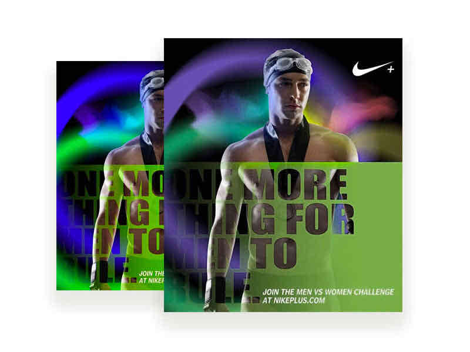

降低饱和度后，运动员并不如原图那么充满活力，我们并没有给图中的人物进行处理，知识针对图中的颜色饱和度降低，最后产生了效果就截然不同。

因为产品的特殊性，现实的东西无法体现出高饱和的色度，所以大多数针对年轻人的广告海报和图片，会通过高饱和的颜色，表现强烈的色彩感，让用户能感受到产品带来的冲击力和信息。

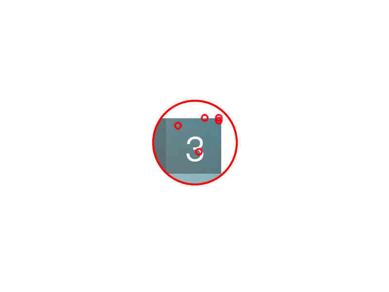

通过测试，3号位置的颜色是最适合年轻运动类的产品。

当然，并不能说只有3号位置的的颜色适合，因为颜色有千万种，那其它位置呢？我们继续测试第二组。

## 文艺清新类

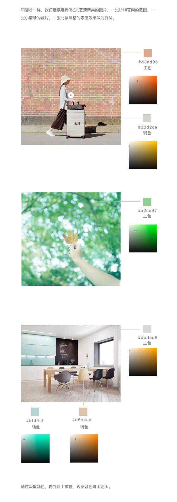
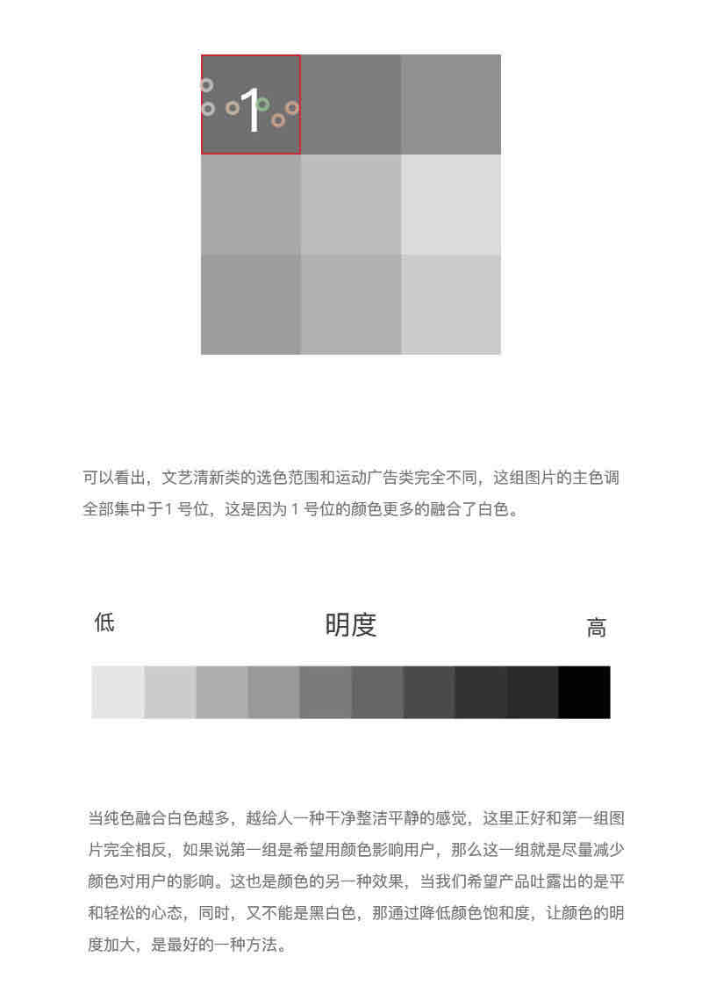

## UI界面类

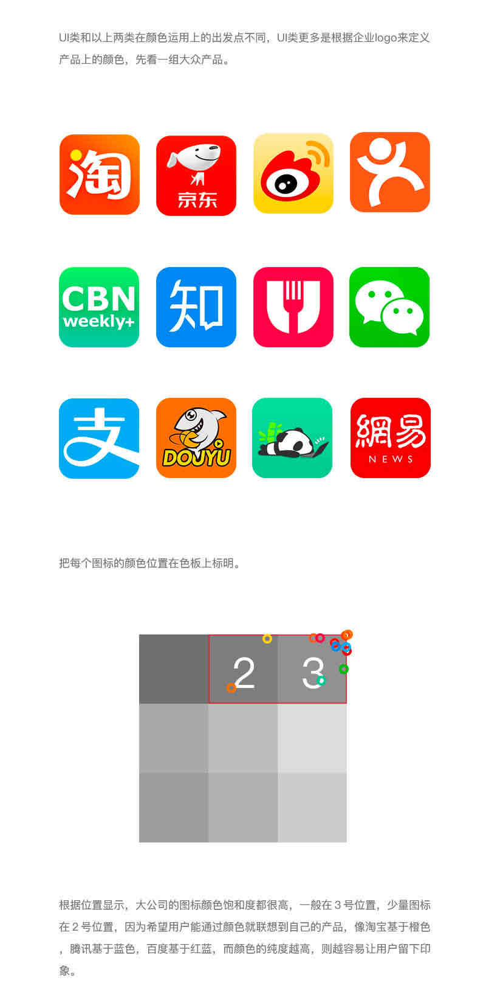
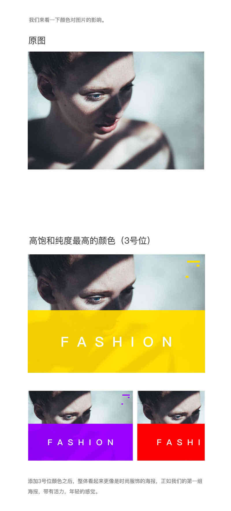
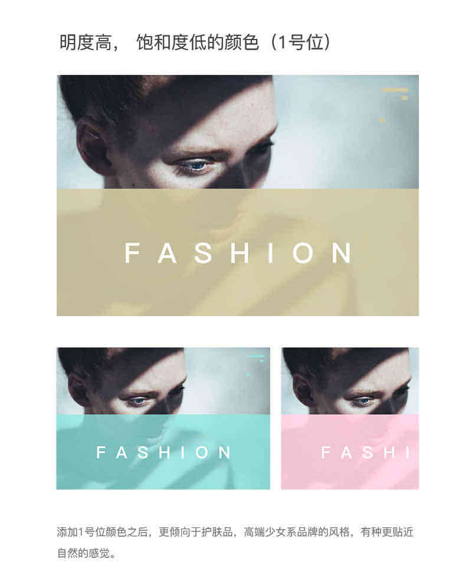
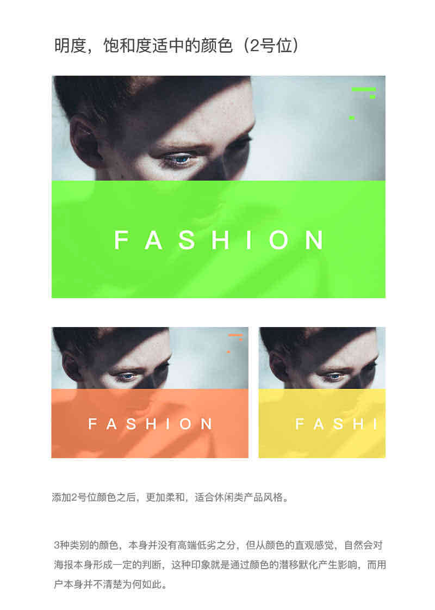

## 练习方法

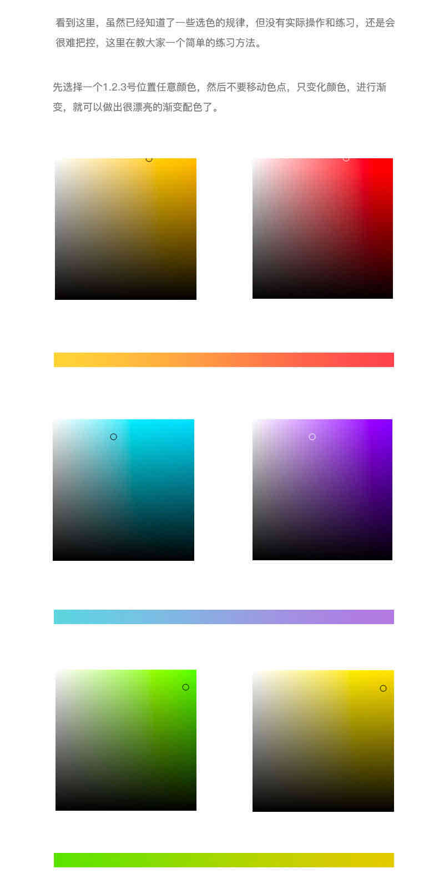

## 总结

- 用一种色彩。这里是指先选定一种色彩，然后调整透明度或者饱和度，产生新的色彩，这样的页面看起来色彩统一，有层次感。
- 用两种色彩。先选定一种色彩，然后选择它的对比色。
- 用一个色系。简单的说就是用一个感觉的色彩，例如淡蓝，淡黄，淡绿；或者土黄，土灰，土蓝。

颜色的搭配千变万化，而且风格多种多样，每种颜色搭配就可以产生不同的效果，并没有严格的规定颜色的使用方法。

而给颜色色块，是为了减少颜色对于设计师在选色上的判断，设计的时候可以问下自己，你的产品针对什么年龄层，你的用户是什么年龄层，你想让自己的画面达到哪些效果？

颜色可以给用户最直观的影响，多问自己，可以更清晰的找到设计思路。