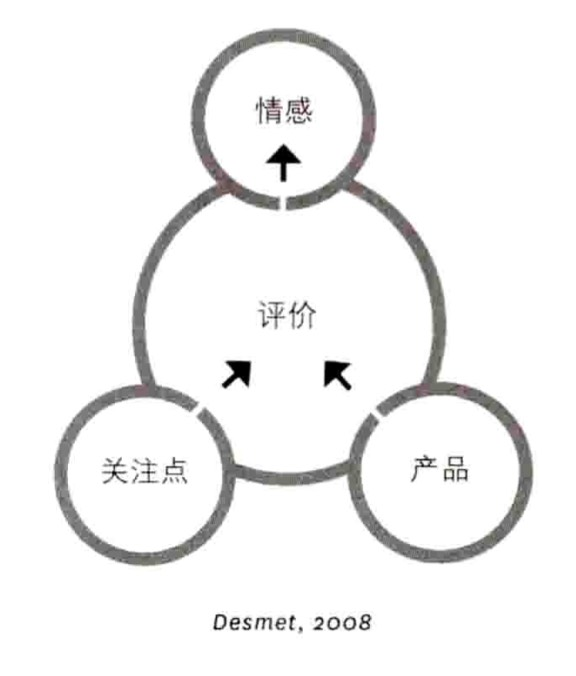
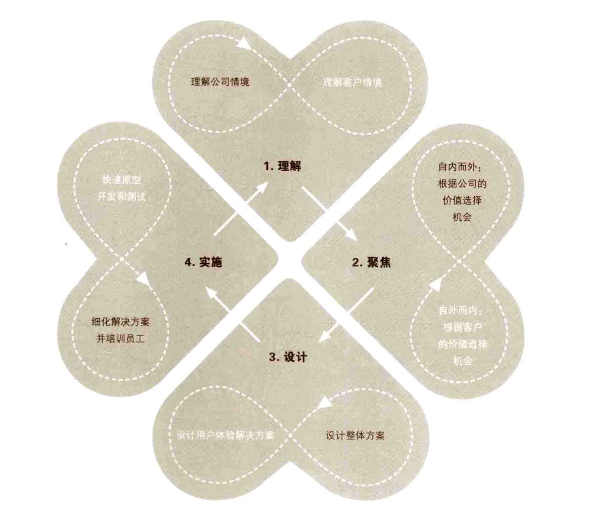
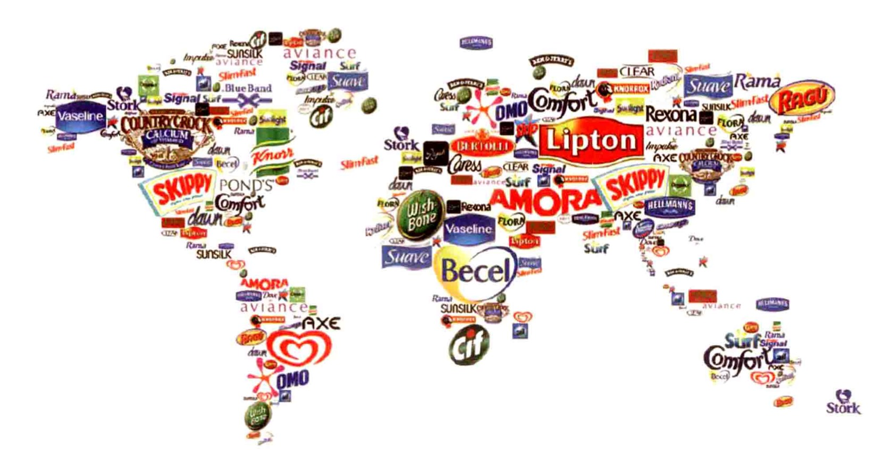

# 情感化设计

------

## 介绍

情感化设计是一种在设计过程中以潜在的情感需求为主要设计原则的设计方式。

## 目的

情感化设计是一种针对预定的情感需求进行产品设计的系统化方式。它可以用于

- 确定合适的情感效应。
- 搜集达到该情感效应所需的相关用户信 息。
- 设想能唤起预期情感效应的设计概念。
- 测量该设计概念满足了多少预期的情 感。

该方式基于一个基础的情感设计模型，它主要区分了设计过程中需要考虑的不同层 面的情感需求。

此模型中的两个关键变量 为 **“刺激因素(stimulus ) “** 和 **“关注点 (concerns ) "** 。

产品可以从三方面对用 户进行情感刺激：

**物体、活动和身份。**

与此相关的三个用户关注点为：

**目标、标准 和态度。**

这两个变量的组合形成了产品的 情感九源矩阵(见图)。

## 主要流程

#### 步骤 1

挖掘用户内在的关注点。设计师需要提出以下三个问题

（1）用户的目标是什么(例如，用户想完成 什么事情或者期待看到什么)。

（2）用户的标准是什么(用户、周围人或物 体在使用中的表现和行为的期待与看法 是什么)?

（3）用户的态度是什么(用户对物体、人或 行为的喜爱、厌恶、偏好是怎样的)？

以上三个关注点应该不仅限于相关的物体 (即所需设计的产品)，还需要与使用产 品过程中的行为以及使用情境中的人(包 括用户)有关。

#### 步骤 2

在使用情境中观察当时的情感反 应，这有利于确定用户关注点。可以将观 察中所得情感作为用户访谈的切入点，进 而挖掘更深层次的关注点。

#### 步骤 3

着重留意用户不同关注点之间可 能存在的冲突，这些冲突能为创造新设计 提供空间。设计概念的情感效应可以通过 PrEmo (产品情感测量工具)进行测量。

## 提示

- 用户关注点应表述为：“我想要……”，"我，某人，某产品应该……”或“我喜欢…” 这些表述应尽可能具体， 其内容不仅要包含用户的目的，还需要 涌盖他们的评判标准及态度。
- 用户至少能从与产品的交互中体验到25 种不同的积极情感。在设计流程中，应首先设计各种预期情感，因为每个情感 需求都与不同的设计相对应°
- 情感化设计即为用户的关注点而设计。 因此，研究用户并确定用户的关注点在 此方式中必不可少。

## 模型的局限性

- 情感化设计只关注设计中的情感效应而 忽略其他设计中必要的因素与需求，因 此建议将此方式与其他常用设计方式结合使用而不要单独使用。

- 虽然此方式的基本概念很容易理解，但在具体实践中需要具备一定的经验。

  

-8"字形循环图展示了创新阶段内部创新活动和外部创新活动之间的迭代过程

荷兰跨国企业联合利华的前身为一家肥皂和黄油制造商，如今联合利华多样化的家用产品遍布全球各地

其他国际品牌有：汉高、宝洁、雀巢.百事等
