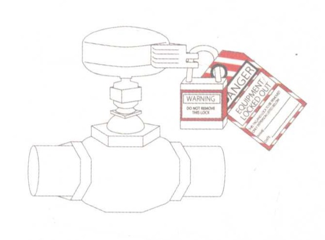

# 包容性

------

## 简介

设计应该能让人避免出错，而且当错误真的发生时，能把负面影响降到最低。

人非圣贤，孰能无过？不过这些 “过” 不一定会酿成灾难。设计的 包容性有助于防患于未然，而且就算真的出错，也能把负面影响降到最 低。

具有包容性的设计提供了安全感和稳定性，因此能鼓励使用者去学习、探索和使用设计。

## 内容

把包容性纳入设计的常见策略包括：

### 创造良好的功能可见性

设计的外观特征会影响其正确用法（例如 形状特殊的插头只能被插到适合的插座上）。

### 设置可撤回动作

如果错误发生，或使用者改变主意，就可以撤回 到前一个或先前的几个动作上（例如软件的“撤消”功能）。

### 设置安全网

一些装置或流程，可以把灾难性错误或失败的负面影 响降到最低（例如飞机上的弹射座椅）。

设置确认流程：在执行重要的行动指令之前，必须确认使用者的意 图（比如在启动某个装置之前，必须先把装置上的锁打开）。

### 设置警告

如标志、提示或警铃等，用来警告即将发生的危险（例 如“前方急转弯”之类的道路警示牌）。

### 提供帮助

帮助使用者进行基本操作，或者排除故障，修正错误的 信息（例如使用说明书或服务热线）。

创造良好的功能可见性、设置可撤回动作，以及设置安全网是获得 设计包容性的首选方法。如果能有效地使用这些策略，就会很少用到确 认、警告及帮助功能。

如果功能可见性很好，帮助就不太能派上用场；如 果动作可以撤回，确认流程就没有存在的必要；如果安全网很完善，就不需要设置警告。

使用确认、警告及帮助系统时，要避免隐晦或者难以理解 的信息或图示。

一定要使所包含的信息能清楚地表明危险或问题，而且要指出可以做哪些动作或者应该做哪些动作。

如果确认或警告太多，互动就 会不那么流畅，确认或警告的提示被忽略的可能性也会增加，一定要记住这点！

设计者应该运用良好的功能可见性，设立可撤回动作以及安全网， 从而提升设计的包容性。

如果没办法做到，就一定要在设计中设置确认、 警告流程和良好的帮助系统。

**注意**：

与设计成功互动所需动用的外力，正好跟设计的品质成反比。也就是说，如果在与设计互动时需要很多帮助才能完成，就说明设计质量欠佳。

## 例子

- Adobe Photoshop的历史记录栏能让使用者回滚到之前的数个动作上，可以 在此基础上重新进行操作。

- 道路标志警告司机前方存在危险，会让道路的包容性提升。

- 万一出现灾难性失控，降落伞系统就相当于安全网，能让驾驶员和飞机平安回到地面。

- 为了确定人们不会在修理系统时粗心大意，常用的确认策略是在启动系统之前把裝置上锁并加上标签。

- 这个插头因具有良好的功能可见性，不会被插到不合适的插座上。

