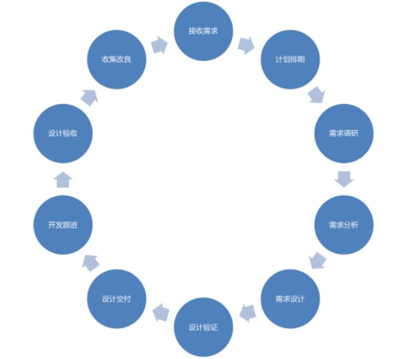

# 设计师工作规范

时间：2022 年 12 月｜编制人：蒯美政｜文档版本：v1.0

---

## 文档说明

**特殊说明：**

本文档用于对设计部门和工作规范的概要简略说明，由于 Word 本地文档的制约性，详细的说明将采取在线的形式即时优先更新。

目前设计部门已有在线规范性文档：

**设计体系文档：**

主要包含：设计指南、网页组件、移动组件、业务模块、场景模式、页面模板、交互设计、体验度量、动效动画……

https://design.shushangyun.com/

**流程/管理/知识规范(仅限内网)：**

主要包含：工具方法、行业竞品、商业研究、需求分析、需求河内、需求交付、技术实现、验收测试、验证改良、瓴犀业务……

https://wiki.shushangyun.com/

敬请期待未来更多……

## 文档目标

- 提升设计师个人工作各方面能力的规范和提升。
- 提升设计师为设计团队和公司的技术沉淀和价值提升。
- 提升设计部门内部流程和规范的标准化实施和管理。
- 提升设计部门在项目团队和公司团队维度更好的协同和交付。
- 提升设计部门在对客户项目交付实施的标准化管理和合作。
- ……

## 规范形式

Word 文档、在线文档…

## 设计师工作流程

共 10 个步骤，涵盖设计从接收需求到收集改良需求的整个体验闭环过程。

## 1.接收需求

需求来源不仅包括产品版本迭代性需求和交付项目需求，还包括：

1. 自己通过各种渠道方式进行调研分析得出的优化性需求；
2. 日常走查发现的体验优化性需求；
3. 日常走查发现的当前产品待改善的问题；
4. ……

## 2.计划排期

**任务**：

由部门管理或者项目负责人进行前期计划的排期和计划、任务的分解并分配给相应的人员。

**输出**：

计划排期、计划各环节的任务、计划交付物……

**方法**：

通过 Worktile、禅道、钉钉等……

## 3.需求调研

**任务：**

对接收到的需求，进行按场景的进行需求调研。

**目标**：

清晰需求设计的用户、场景、目标等……

**调研对象：**

产品经理、售前、售后、客户等相关人员…

**输出：**

在设计稿文件或者其它形式的输出物存档在项目文件夹。

**更多需求调研内容，请查看：**

**行业竞品：**

https://wiki.shushangyun.com/docs/industry/intro

**商业研究：**

https://wiki.shushangyun.com/docs/business/intro

## 4.需求分析

**任务：**

根据上一阶段的调研，将抽象的需求转化为具象的业务目标和设计目标，再将分析的设计目标，转化为具体的设计方案输出。

**输出：**

在设计文件上输出设计思路并存档。

**更多需求分析内容，请查看：**

https://wiki.shushangyun.com/docs/analysis/intro

## 5.需求设计

在设计需求之前，需要了解和熟悉整个体系，其中包含：

设计指南、网页组件、移动组件、业务模块、场景模式、页面模板、交互设计、体验度量、动效动画……

### 5.1 高保真设计

**任务：**

在这一环节，需要对根据需求或者原型提供的需求，进行设计初步设计。

**结果：**

需要设计好相应的功能结构(部分)、流程框架，设计布局。

**输出：**

高保真设计稿。

**注意点：**

在这一步，先同步给设计团队内部或上级，内部先评审确认后，再深入设计细节的设计。

### 5.2 视觉稿设计

**任务：**

完成基于设计部门高保真设计的设计稿。

**输出：**

完成视觉设计稿，并将设计稿上传至 CoDesign。

:::caution 注意点

1. 设计稿中的文案要真实，贴合业务功能场景，而不是直接复制粘贴文字，或用`*`、`X`代替。
2. 设计稿如有对原型进行修改的（字段级、功能级、页面级布局），需要同步给产品经理，对确实能提升产品体验的，产品经理需要对做出的设计修改在原型上同步体现出来，减少下游的理解成本和研发效率。

:::

## 6.设计验证

### 6.1 自行验证

自己先按照在线文档验证设计的可用易用性。

**在线链接：**

https://wiki.shushangyun.com/docs/category/%E8%AE%BE%E8%AE%A1%E9%AA%8C%E8%AF%81

**其中主要包含：**

1. 场景完整性
2. 逻辑完整性
3. 用户完整性
4. 交互完整性
5. 内容完整性
6. 进度完整性

### 6.2 上级评审

经过自行验证后的设计同步给上级进行查看审核。

### 6.3 团队评审（可选）

部分改动比较大或者交互点比较多的设计，可单独拉上相应成员进行正式或者非正式的会议评审，同步设计点给团队。

**关于需求评审内容，更多请查看：**

https://wiki.shushangyun.com/docs/category/%E9%9C%80%E6%B1%82%E8%AF%84%E5%AE%A1

## 7.设计交付

完成确认完设计后，需要将设计稿上传至 CoDesign，并按规范命名和整理好设计画板，方便团队成员查看。

具体规范命名和管理，请看在线文档。

**关于设计交付内容，更多请查看：**

https://wiki.shushangyun.com/docs/handoff/%E4%BA%A4%E4%BB%98%E6%96%87%E6%A1%A3/%E8%AE%BE%E8%AE%A1%E4%BA%A4%E4%BB%98%E6%96%87%E6%A1%A3

## 8.开发跟进

开发过程中，要即时跟进开发过程中的问题，及时解答和调整。

**主要包括：**

1. 开发过程的切图交付
2. 开发过程中设计及交互点的解答
3. 开发对于设计点工作量较大，经设计内部评估可以进行妥协的
4. ……

## 9.设计验收

产品验收及现状走查。

### 9.1 设计验证

**详情请查看**：

https://wiki.shushangyun.com/docs/category/%E8%AE%BE%E8%AE%A1%E9%AA%8C%E8%AF%81

### 9.2 走查验证

**主要包括以下内容：**

1. 业务维度：哪方面业务没有满足用户的，方便设计拓展概念，进行设计驱动业务增长。
2. 功能维度：哪些功能未满足用户需求的及功能不够深入的。
3. 交互维度：现有功能哪些交互可以进行优化的，提升产品的可用性、易用性等体验绩效的。
4. 视觉维度：现有页面中存在的视觉问题。

**更多内容请查看**：

https://wiki.shushangyun.com/docs/category/%E4%BA%A7%E5%93%81%E7%8E%B0%E7%8A%B6%E8%B5%B0%E6%9F%A5

### 9.3 提交 BUG 给开发指南

**详情请查看**：

https://wiki.shushangyun.com/docs/testing/product-acceptance/%E8%AE%BE%E8%AE%A1%E9%AA%8C%E6%94%B6

## 10.收集改良

基于用户需求与业务场景，通过体验度量体系，高效的评估和验证设计的体验数据。

通过对体验数据的实践，可以有效了解当前产品中存在的体验问题，进而指导团队进行产品体验的深入优化。

**更多内容请查看**：

https://design.shushangyun.com/docs/analyze/intro/

## 设计部门架构

| 人员   | 职责                                                   | 负责产品         |
| ------ | ------------------------------------------------------ | ---------------- |
| 蒯美政 | 整体部门管理、产品规范、设计指导、需求设计、需求跟进…… | 整体             |
| 简洁文 | 需求设计                                               | 瓴犀             |
| 罗绮娜 | 需求设计                                               | 瓴犀             |
| 熊震   | 需求设计                                               | KPay、数商云官网 |

## 文档修改历史

| 日期       | 版本 | 作者   | 修改内容 | 发布日期 |
| ---------- | ---- | ------ | -------- | -------- |
| 2022/12/09 | V1.0 | 蒯美政 | 初稿     |          |
