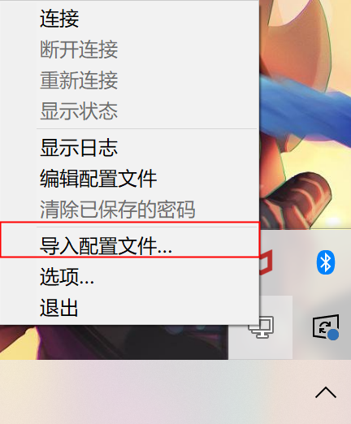
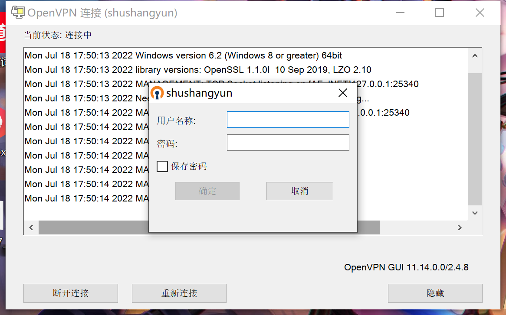

# 内网

内网 VPN 账号可以找任何一个运维同事开通。推荐最帅运维：`赖志行`。

------

## 1、选择适配自己的系统软件安装

### Mac 系统

openvpn-mac.dmg

### Windows 系统

openvpn-install-2.4.8-1602-Win10.exe

配置文件：shushangyun.ovpn

## 2、安装完毕，导入配置文件

## 3、完成以上步骤，双击登录账号连接即可

