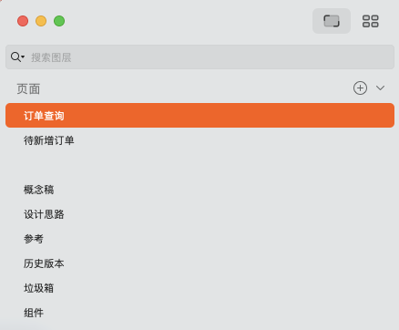

# 设计交付文档

## 版本迭代交付

设计输出交付统一上传至 codesign

- 页面设计稿
- 页面设计稿的有关交互补充说明
- 设计稿的交互动画（可选）

## 广告资源图交付

### 需求方申请设计需求规范

瓴犀商城门户广告图需求文档

在线链接：https://docs.qq.com/sheet/DU09wa3dZSlpPV3lk

:::tip

需求方请按照表格规范提交需求给设计方。

<a target="\_blank" href={require('./assets/瓴犀商城图片需求模板.xlsx').default}> <b>下载广告图需求文档模板</b> </a>

:::

<!-- <iframe src="https://docs.qq.com/sheet/DU09wa3dZSlpPV3lk" height="300" width="100%"></iframe> -->

### 设计方设计完成交付规范

- 图片切图给需求方
- 广告设计图整理进 codesign 的素材库

:::info

放进素材库后以后需求方就可以直接进入素材库寻找自己想要的图片。

:::

## 设计稿管理规范

### 设计稿文件

设计稿文件按照项目的模块来分类。

### 设计稿画板命名

设计稿画板命名按照模块、页面、页面类型三个维度进行管理命名。

:::info 例如

采购订单 
----订单查询 
----待新增采购订单 
--------待新增采购订单-新增 
--------待新增采购订单-详情 
--------待新增采购订单-编辑 
----待审核采购订单 

采购订单为：`文件`，待新增采购订单为：`页面`，待新增采购订单-新增为：`页面类型`。

画板命名：`A.1 待新增采购订单`，`A.2 待新增采购订单-新增`，`A.2 待新增采购订单-新增-选择数据`

画板命名参考链接：https://codesign.qq.com/app/design/6dqN2922Wd9aBXe/board

sketch 文件页面示例：

:::

### 设计稿文件页面

标准的设计稿文件应该包含以下页面结构：

- 设计稿页面的名称，比如：订单查询、待新增订单...
- 用于方便管理设计稿页面的其它页面，比如：概念稿、设计思路、参考、历史版本、垃圾箱、组件...

注意：设计稿页面和其它页面中间加一个空页面，用于分隔页面，增加易读性。

