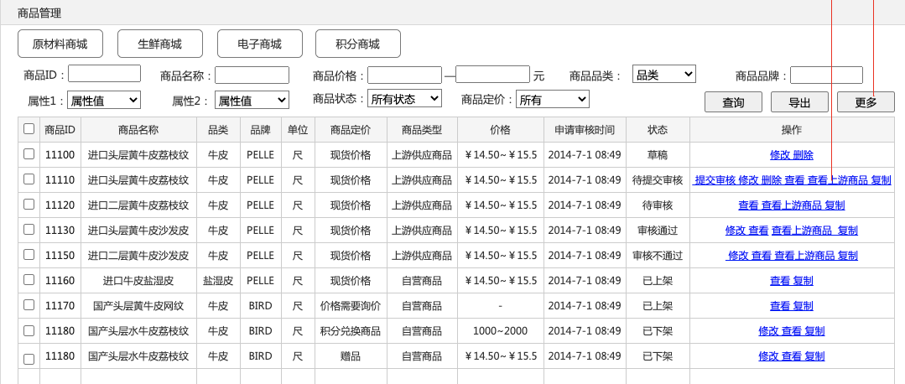

# 商品列表

[设计稿页面](http://design.shushangyun.com/web-components/basic/button)

## 业务场景

…

## 设计目标

…

## 页面按钮操作

| 按钮     | 数据规则             | 按钮组件                                                     |
| -------- | -------------------- | ------------------------------------------------------------ |
| 新增商品 | 来源新增商品时的设置 | [主要按钮](http://design.shushangyun.com/web-components/basic/button) |
| 导入商品 | xxxx                 | [次要按钮](http://design.shushangyun.com/web-components/basic/button) |
| 删除商品 | xxxx                 |                                                              |

## 可搜索字段

| 可搜索字段 | 数据规则 |      |
| ---------- | -------- | ---- |
| 商品ID     | xxx      |      |
| 商品名称   | xxxx     |      |
| 商品价格   | xxx      |      |

## 列表字段

| 字段     | 数据规则             | 说明             |
| -------- | -------------------- | ---------------- |
| 商品ID   | 来源新增商品时的设置 | 需要支持列表排序 |
| 商品名称 | xxxx                 |                  |
| 品类     | xxxx                 | 需要支持列表筛选 |

## 商品状态操作权限

| 状态       | 状态说明 | 支持操作                                 |
| ---------- | -------- | ---------------------------------------- |
| 草稿       | xxxx     | 修改，删除                               |
| 待提交审核 | xxxx     | 提交审核、修改、删除、查看上游商品、复制 |
| 待审核     | xxxx     | 查看上游商品、复制                       |

## 原型预览

