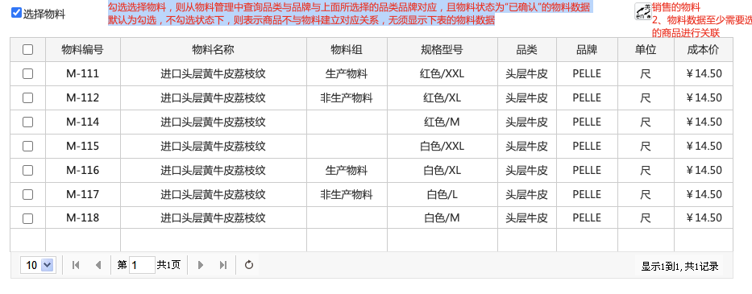

# 新增商品

示例文档说明。

[设计稿页面](http://design.shushangyun.com/web-components/basic/button)

## 业务场景

…

## 设计目标

…

## 1、商品审核流程

| 流程步骤序号 | 流程步骤说明 | 流程步骤角色 |
| ------------ | ------------ | ------------ |
| 1            | 新增商品     | 供应商       |
| 2            | 审核商品     | 平台         |

## 2、选择品类

| 字段标签 | 字段值               | 字段类型  | 规则说明                           |
| -------- | -------------------- | --------- | ---------------------------------- |
| 最近使用 | 成品皮-牛皮-头层牛皮 | 下拉选择  | 记录上一次成功发布商品时选择的品类 |
| 商品品类 | 成品皮-牛皮-头层牛皮 | 下拉选择  | –                                  |
| 品类类型 | 实物商品             | 文本-只读 |                                    |

## 3、选择品牌

| 字段标签 | 字段值 | 字段类型 | 规则说明 |
| -------- | ------ | -------- | -------- |
| 商品品牌 | PELLE  | 下拉选择 | xx       |

## 4、选择物料

#### 选择物料

建议组件：[勾选框](http://design.shushangyun.com/web-components/basic/button)

勾选选择物料，则从物料管理中查询品类与品牌与上面所选择的品类品牌对应，且物料状态为“已确认”的物料数据。

默认为勾选，不勾选状态下，则表示商品不与物料建立对应关系，无须显示下表的物料数据

#### 物料数据列表字段：

建议组件：[列表](http://design.shushangyun.com/web-components/basic/button)

| 字段     | 数据规则     | –    |
| -------- | ------------ | ---- |
| 物料编号 | xxxx         |      |
| 物料名称 | xxxx         |      |
| 物料组   | xxxx         |      |
| 成本价   | 小数点后两位 |      |

#### 图示：

## 商品状态操作权限

| 状态       | 状态说明 | 支持操作                                 |
| ---------- | -------- | ---------------------------------------- |
| 草稿       | xxxx     | 修改，删除                               |
| 待提交审核 | xxxx     | 提交审核、修改、删除、查看上游商品、复制 |
| 待审核     | xxxx     | 查看上游商品、复制                       |
