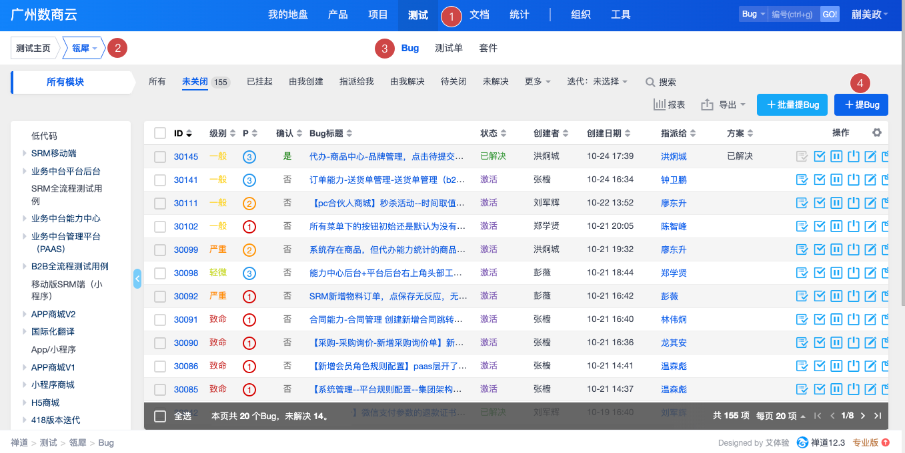

# 设计验收

设计师的验收流程。

---

## 登录禅道

http://chandao.shushangyun.com/index.php?m=my&f=index

## 提交流程

1. 选择菜单`测试`

2. 选择项目`瓴犀`

3. 选择菜单`Bug`

4. 点击按钮`提Bug`

## Bug 填写

| 表单字段 | 字段填写说明                             |
| -------- | ---------------------------------------- |
| 所属项目 | 选择是哪个项目                           |
| 当前指派 | 设计师填写的 Bug，当前指派填写：`许佳敏` |
| 重现步骤 | 填写设计问题说明，可以截图，可以文字     |
