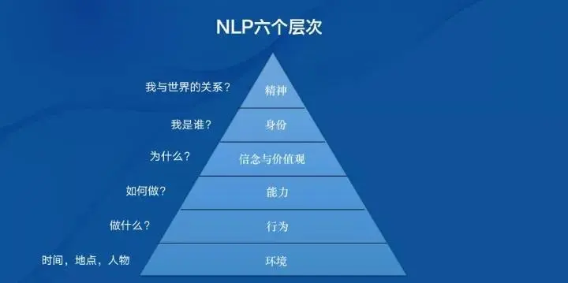

# NPL思维逻辑层次

------

## 内容

### 1.认知处于环境层：

关注和聚焦的都是外在环境对自己影响和支持。

人会把一切问题外部归因化，一切都是别人的原因，都是因为环境不好，才导致如此恶劣的命运。

这样的人，通常都表现为爱抱怨，或者“祥林嫂”，只知怨怼别人，不思进取改变自己

### 2.认知处于行为层：

万事先去做，做了再说，行动力是第一指导力，中心思想就是我还不够努力。

相对于外部归因，认知处于行为层的人通常把问题，归咎于自己的行动力不足；

他们比较相信，我现在不够幸运，是因为行动力不足，我现在还没幸福，是因为做的还不够；但他们没有思考过，怎样努力更有价值

### 3.认知处于能力层：

看重能力的提升，追求战术上的勤奋，中心思想就是方法总比困难多。

这一层次的人，会觉得自己的问题是能力还不够，能力不够的表现是不停地学习新知识，用思维和知识武装自己。

### 4.认知处于信念层/价值观：

面对诱惑，面对多种方法途径，你会做出选择，按照自己内心价值观，做出适合自己的选择，中心思想就是什么最重要？

就会思考什么是对自己重要的事情，他们专门做对的事情。

### 5.认知处于身份层：

他们会更多得关注内心最本质的问题：“我是谁，我想成为什么样的人。

思考清楚这个问题，他们会为自己配备相应的思考模式和行动模式

### 6.认知处于愿景层：

他们更多地会去思考“我与这个世界的关系是什么样的？我如何能改变世界？”

处于这一认知水平的人，关注得是人类愿景这样宏大的命题，他们的工作就是为人类大部分人服务，帮助大部分人改变命运。

