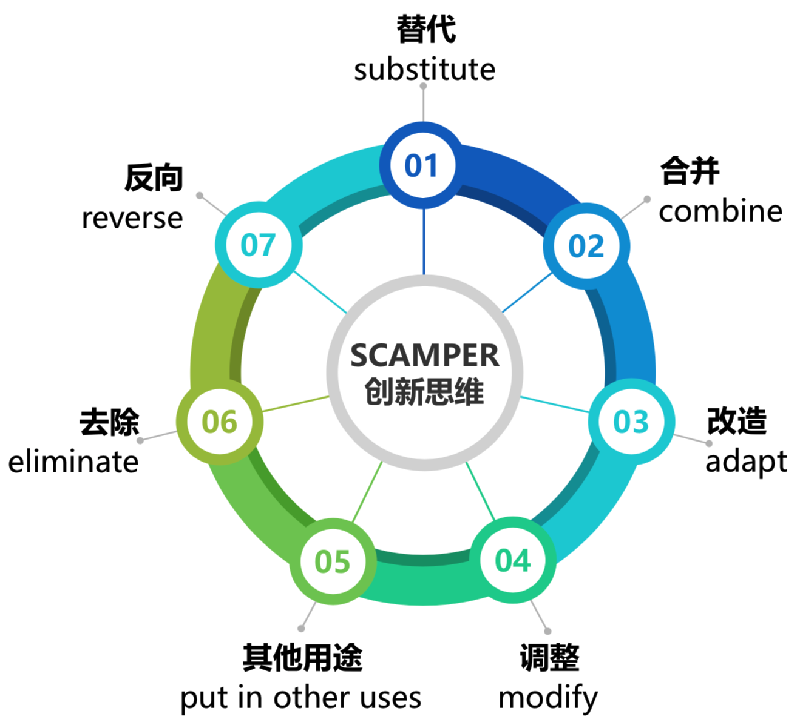

# SCAMPER创新思维

------

## 介绍

SCAMPER是一种创新思维方法，常用在改进现有产品、服务或商业模式中，由美国心理学家罗伯特 艾伯尔创作。

它包含七个切入点：替代、合井、改造、调整、改变用途、去除、反向，通过7点有助于检验是否有更好的改进现状的新想法。

## 内容

### 替代 substitute

### 合并 combine

### 改造 adapt

### 调整 modify

### 其它用途 put in other uses

### 去除 eliminate

### 反向 reverse

## 何时用

当你需要改进现有产品、服务或商业模式时，可用SCAMPER思考。
