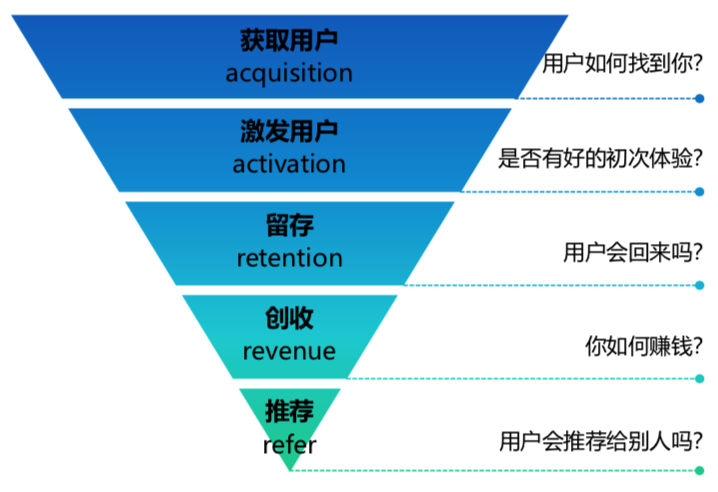

# AARRR漏斗模型

------

## 介绍

由美国著名风险投资机构的创始人戴夫-•麦克卢尔提出，由acquisition(拉新），activation(促活），retention(留存），revenue(创收），refer(推荐)五个阶段组成，展示了用户全生命周期。AARRR模型的核心思想也可应用于学习、个人成长等领域。

## 何时用

当你思考产品对应的用户全生命周期时，可参考此模型。
