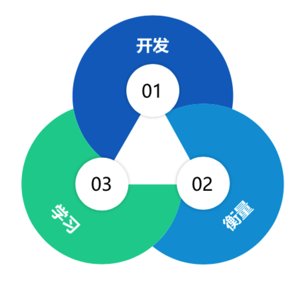

# 最小可行性产品

------

## 介绍

最小可行产品(Minimum Viable product，简称MVP) 的概念由Eric Ries在《精益创业实战》中提出，指的是用最快、最筒明的方式建立一个可用的产品原型，推向布场，测试用户是否喜欢这个产品，进而迭代完善细节，利用MVP横型我们可以低成本试错，不断迭代单品。

## 何时用

当你面对多重选择，你可以构建一个MVP（最小可行方案），降低成本试错，做出正确决策。
