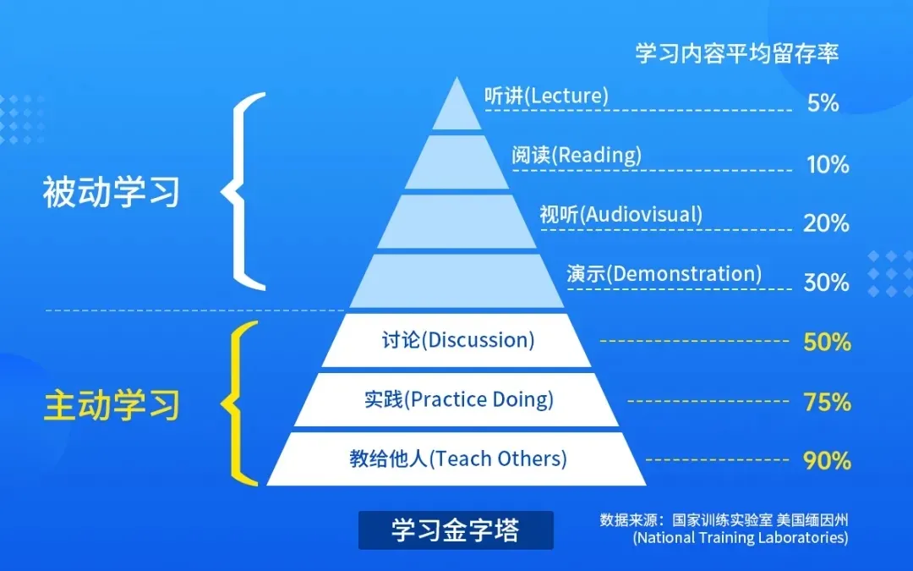

# 学习金字塔

------

## 模型介绍

学习金字塔是美国缅因州的国家训练实验室研究成果，

它用数字形式形象显示了：

采用不同的学习方式，学习者在两周以后还能记住内容（平均学习保持率）的多少。

根据此模型，学习效果在30%以下的，都是个人学习或被动学习；

而学习效果在50%以上的，都是团队学习、主动学习和参与式学习。

## 何时用

当你需要学习新知识新技能时，可以参考此模型，找到最有效的学习方法。
