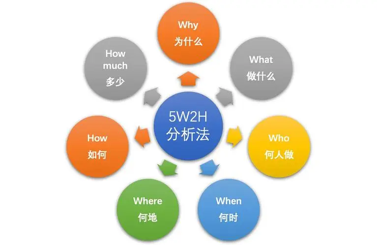

# 5W2H 分析法

------

## 简介

#### WHAT 对象

是什么？目的是什么？做什么工作？

#### WHY 原因

为什么要做？可不可以不做？有没有替代方案？

#### WHO 人员

谁？由谁来做？

#### WHEN 时间

何时？什么时间做？什么时机最适宜？

#### WHERE 地点

何处？在哪里做？

#### HOW 方法

怎么做？如何提高效率？如何实施？方法是什么？

#### HOW MUCH 程度

多少？做到什么程度？数量如何？质量水平如何？费用产出如何？

## 作用

发现解决问题的线索，寻找发明思路，进行设计构思。

同时也是很好的头脑风暴方式，适用于任何问题。

## 何时用

当你面对一个复杂问题时，可以从5W2H方面怼问题进行全面分析。

