# Charles

 

---

### Charles简介 💡

**Charles** 又名 **青花瓷** ，是Mac端的一款截取与分析网络请求的工具(windows也可以用)，在网络开发中使用其作分析：

>拦截别人软件的发送的请求和后端接口。

>后端返回的response拦截修改后再接收以达到测试临界数据的作用。

>写脚本重复拦截抓取别人的数据。

>支持流量控制，可以模拟慢速网络以及等待时间较长的请求。

>支持重发网络请求。

>支持SSL代理,可以截取分析SSL的请求。

---

#### 下载安装 💡

官网下载        👉👉[官网链接](http://www.charlesproxy.com/download)

安装完后👇👇👇

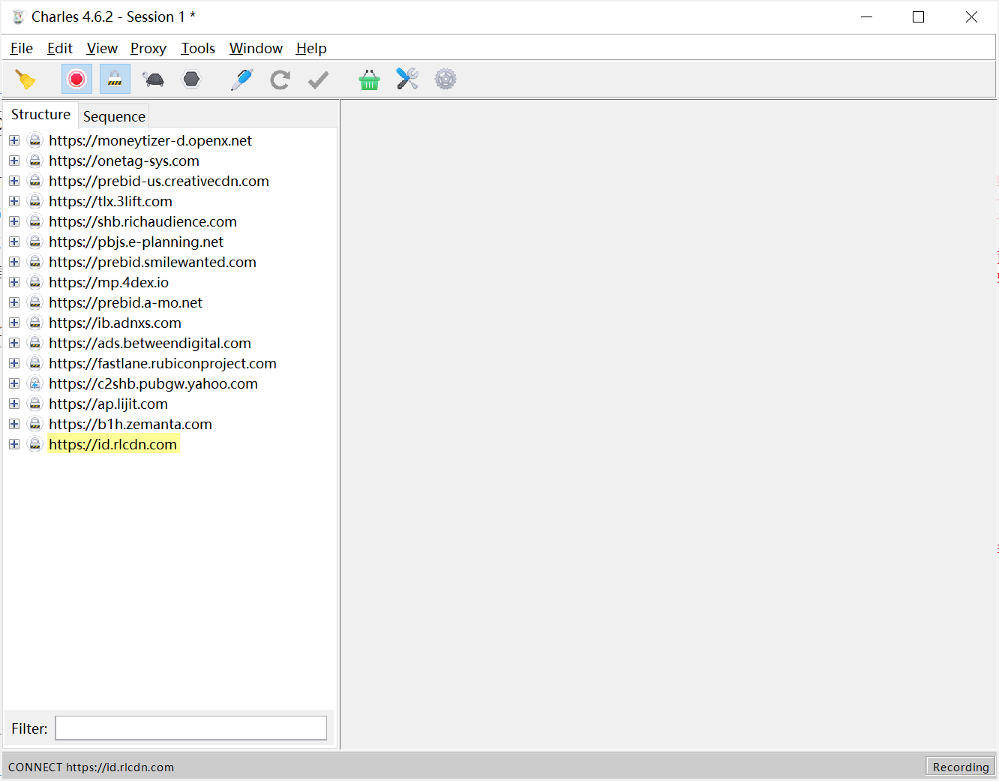 

未破解的可以免费试用30天。试用期过后，未付费的用户仍然可以继续使用，但是每次使用时间不能超过30分钟，软件启动时将会有10秒种的延时

---

#### 破解 💡
1. 打开https://www.zzzmode.com/mytools/charles/ , 点击生成，跳出弹框，复制License Key的值

👇👇👇

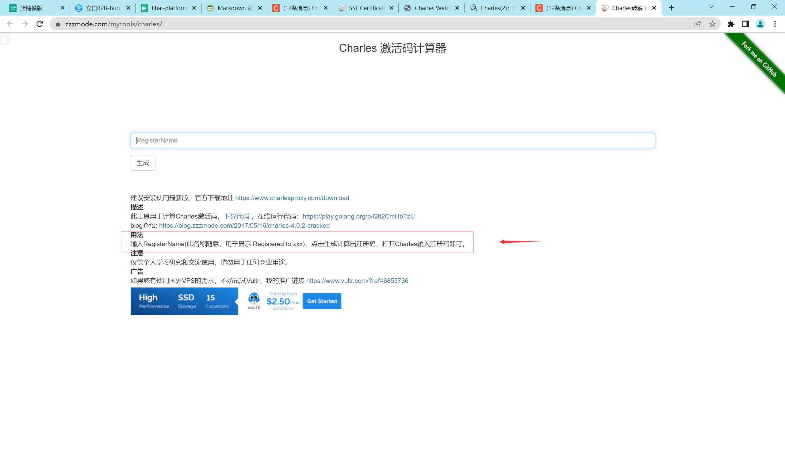

2. 点击生成，跳出弹框，复制License Key的值

👇👇👇

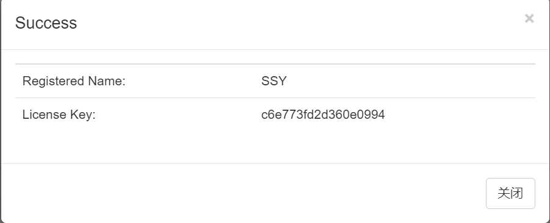

3. 打开Charles 工具后，点击 Help——Registered Name，跳出弹框输入版本号和 License Key 的值，点击Register ,成功之后显示需要重启

👇👇👇

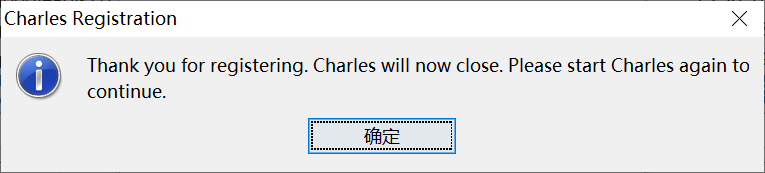

4. 成功之后显示网址的name👇👇👇

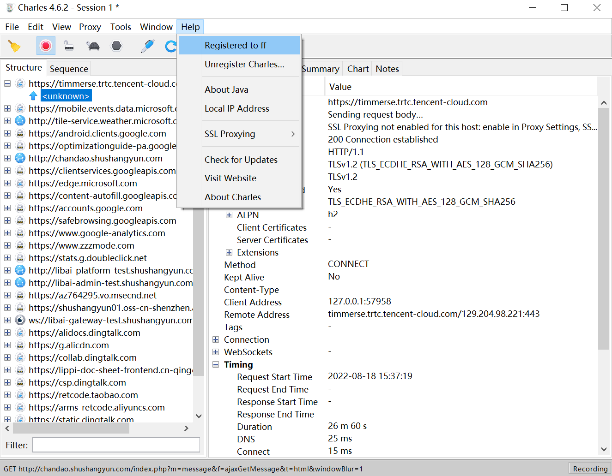

---

#### 设置Proxy 💡

1. 安装证书：
>在顶部工具栏中选择“help--Install Charles CA SSL Certificate”👇👇👇

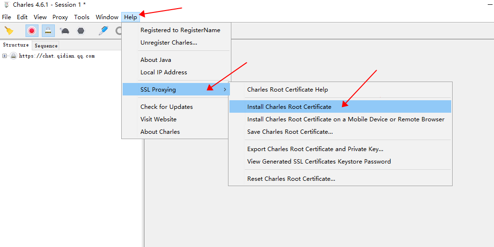

2. 选择安装证书，接下来将证书存储改为：受信任的根证书颁发机构，接下来都点“下一步”👇👇👇

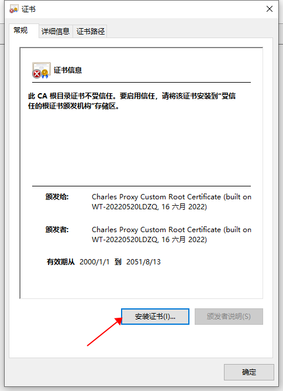

3. 修改proxy settings
>选择“Proxy--Proxy Settings”，弹出proxy设置选项卡，勾选“Enabling transparent HTTP proxying”👇👇👇

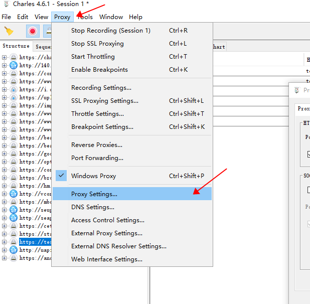

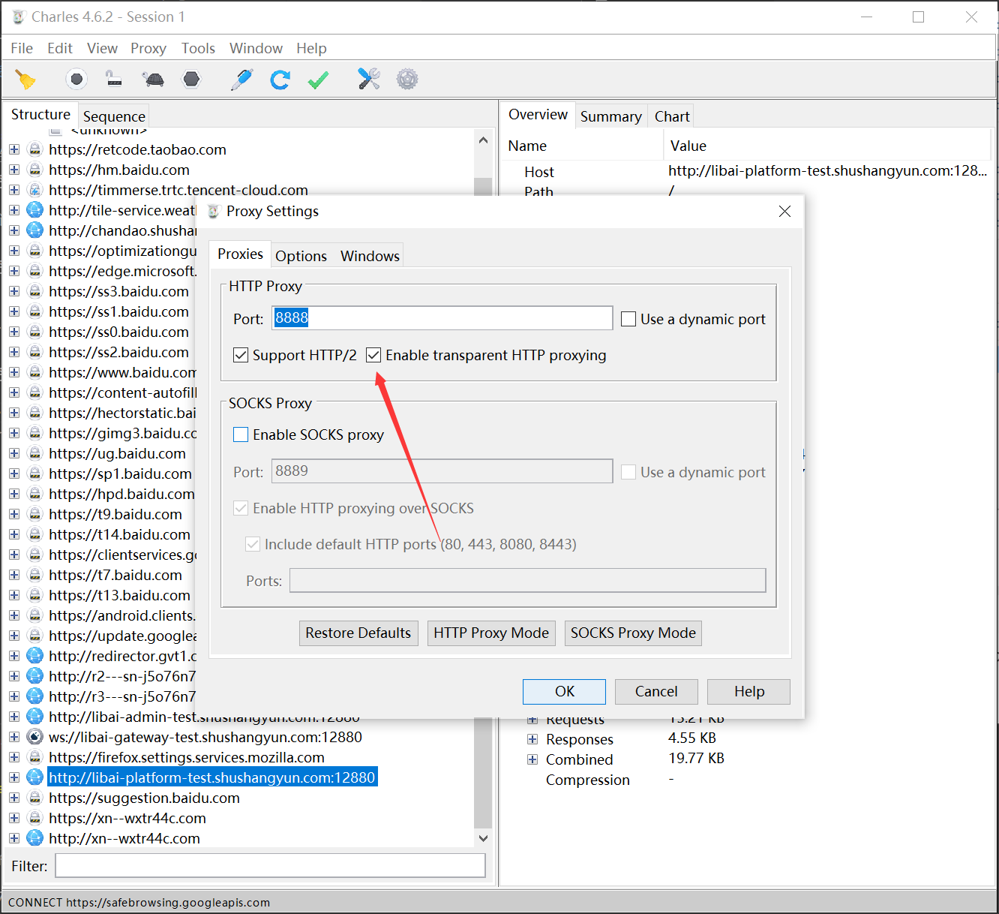

4. 修改SSL Proxy Settings：

>选择“Proxy—SSL Proxy Settings”，勾选“Enable SSL Proxying”，在Location部分选择add，如下图所示，host中填“*”，port中填“*”，表示任务域名的数据👇👇👇

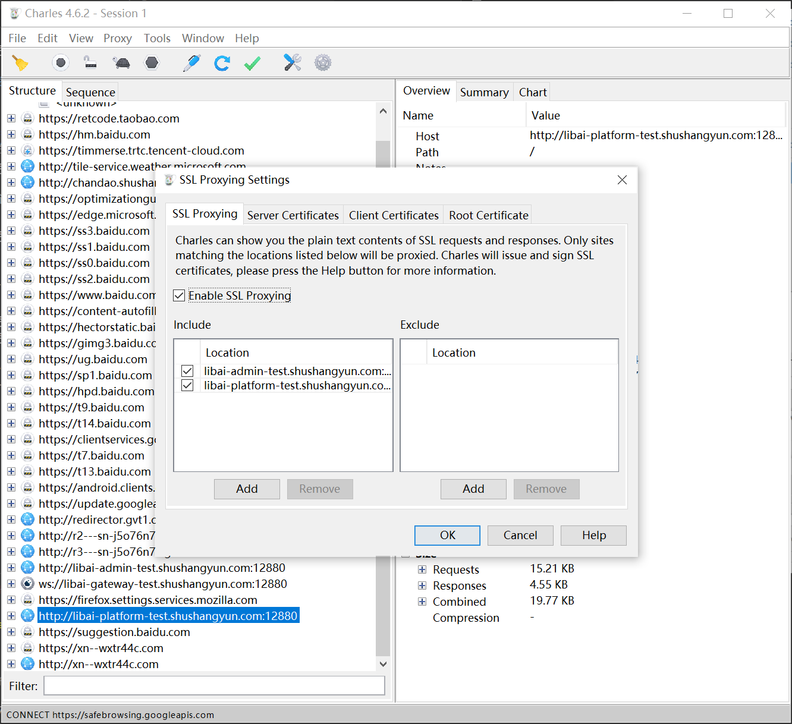

5. 保存成功后，这时访问PC浏览器，再去抓取https的请求，就能正常查看里面的数据信息了

---

#### app抓包 💡
1. 在菜单栏上选择“Proxy -> Proxy Settings”，填入代理端口 8888，并且勾上 “Enable transparent HTTP proxying”👇👇👇

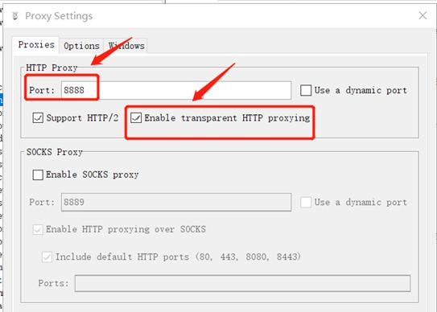

2. 获取 Charles 运行的电脑的 IP ：在Charles 的顶部菜单，点击“Help -> Local IP Address”，即可在弹出的对话框中看到 IP 地址👇👇👇

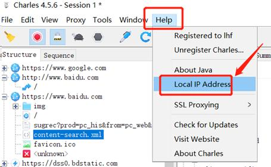

3. 在手机上无线局域网配置中，选中所连的wifi，选择手动配置代理：服务器主机填写charles运行所在的电脑IP，端口号默认都填写8888，保存

4. 打开手机浏览器，输入chls.pro/ssl，访问下载charles证书，将证书安装到手机上
   
  （IOS手机，还需要在手机中开启证书信任：进入“设置—>通用—>关于本机—>证书信任设置”，开启刚才安装的charles证书）

5. 此时用手机访问各请求时，会先在电脑运行的charles中弹出一个对话框请求确认连接，点击确认允许就行了👇👇👇

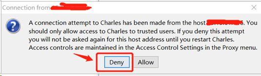
